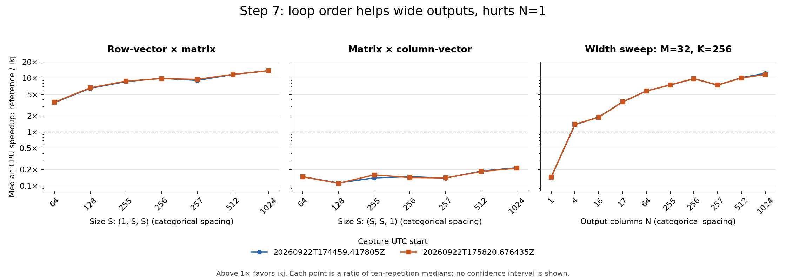

# Step 7: Memory access experiments

**Roadmap Step 7 is complete.** Parts 6–8 add two 24-shape captures (960
measurements), compiler and executable inspection, and a measured starting point
for cache blocking. See **Parts 6–8: final analysis** below. Both kernels are
retained: ikj benefits the tested wider outputs but loses the N=1 workloads.
Debug, Release, sanitizer, and collector checks pass. No tiled kernel or runtime
dispatch has been introduced; those are future work.

The first experiment and September 21 evidence below are preserved as history.

## Experiment 1: row-col-k versus row-k-col

### Question and hypothesis

For row-major FP32 matrices A[M,K] and B[K,N], does row-k-col traversal
reduce allocation-inclusive CPU time compared with row-col-k traversal?

The hypothesis is that row-k-col will improve larger N>1 workloads by accessing
B contiguously and reusing each A value across columns. The primary target,
selected before measurement, is (M,K,N) = (256,256,256). This follows the
evidence in [PROFILING.md](PROFILING.md).

The reference inner loop advances through A by 4 bytes and B by 4*N bytes
(1,024 bytes for the primary target). The proposed variant traverses B and C
rows in 4-byte steps and holds one A value for the inner column loop. It also
replaces a local dot-product accumulator and final C assignment with repeated
C updates. These are source-level patterns; inspect compiler output to establish
the actual loads, stores, and arithmetic instructions.

### Implementations and controls

Keep `matmul_reference` unchanged. Introduce a separate `matmul_ikj` function
using row-k-col traversal, a local A(row,k) value, and accumulation into the
zero-initialized output. Contributions to each output remain in increasing k order.

Hold these conditions fixed between implementations:

- Owning, contiguous row-major FP32 Matrix storage and checked `operator()` access.
- Shape validation, fresh output ownership, input immutability, empty-output
  behavior, and zero output when K=0.
- Single-thread execution, compiler version, Release flags, and floating-point options.
- Inputs: A[i] = float(int(i % 17) - 8) / 8.0f;
  B[i] = float(int(i % 13) - 6) / 6.0f.
- Timed work: output allocation, zero-initialization, multiplication, and destruction.
  Input allocation/filling stays outside timing; retain the output-use barriers.
- Reused input buffers, warm-up enabled, and no explicit cache flushing.

Do not add tiling, packing, transposition, raw-pointer kernels, explicit SIMD,
fast-math, threading, or shape-based dispatch in this experiment. Normal compiler
auto-vectorization remains enabled equally for both implementations.

### Workloads and protocol

Measure both implementations for every existing shape:

| M | K | N | Purpose |
|---:|---:|---:|---|
| 1 | 1 | 1 | Tiny-call overhead control |
| 32 | 32 | 32 | Small square |
| 128 | 128 | 128 | Medium square |
| 256 | 256 | 256 | Primary target from Step 6 |
| 63 | 65 | 67 | Awkward rectangular dimensions |
| 1 | 256 | 256 | Row-vector times matrix |
| 256 | 256 | 1 | Matrix times column-vector; contiguous reference B access |

Both implementations have hand-computed and independent double-precision oracle
coverage, including all benchmark shapes and reductions up to K=1025. The error
bound and Debug, Release, and sanitizer commands are documented in
[TESTING.md](TESTING.md). These checks must pass before measurement.

The collector validates repetitions by implementation and shape, requires all
14 expected cases, and rejects duplicate/missing repetitions and invalid timings.
Eight parser regression tests run through CTest with benchmarks enabled.

Use the [Step 5 follow-up protocol](BENCHMARKING.md): 1-second warm-up, at least
1 second per repetition, and 10 repetitions per implementation/shape. Collect
at least two complete comparisons without Instruments, measuring the reference
again in the same session. Record execution order and counterbalance or interleave
implementations to limit order bias. Record actual background activity, power and
thermal observations, compiler flags, source revision/dirty state, and commands.
Retain all repetitions, source snapshots, metadata, and logs.

### Analysis and decision

For every shape and capture, report median CPU time, variability (including CV),
GFLOP/s, and speedup = reference median / variant median. Compare within-run
variation and agreement across captures. Historical C-D measurements provide
context, not a substitute for the current reference or a universal 1.39% cutoff.

Consistently lower time on the primary target, distinguishable from observed
variation, supports the hypothesis. Noisy results are inconclusive and require
more evidence. Consistent equal or higher time fails to support the hypothesis.
Report all shapes and regressions without selecting only winning cases.

Inspect vectorization diagnostics and assembly for both variants, including
N=1 and N>1 paths. Explain results using observed instructions and access patterns.
Timing alone cannot prove cache misses, bandwidth saturation, cache capacity,
or improvement caused exclusively by locality: vectorization, accumulator
dependencies, and C traffic may also change.

Keep or reject the experimental variant based on correctness and measured
workload tradeoffs, preserving the reference and evidence either way. Follow
this first comparison with matrix-vector and size sweeps before declaring
the broader Step 7 milestone complete.


## Parts 4–5 results — September 21, 2026

The primary CPU-time hypothesis is supported in these measurements: `ikj` has
lower median CPU time for (256,256,256) in every capture, with C–D speedups of
9.590× and 9.710×. For (256,256,1), it is consistently much slower: 6.891× and
7.006× the reference time in C–D. Keep both implementations; these results do
not justify replacing the reference universally or introducing dispatch yet.

### Saved evidence and comparability

The first pair A–B used opposite implementation orders. Large wall-time gaps
and noisy CPU timings prompted a complete follow-up pair C–D using a temporary
`caffeinate -i` assertion during each benchmark process. No saved power settings
were changed. All four captures contain 140 individual measurements, for **560
measurements retained without filtering**. The incomplete short collector check
in `benchmark-results/local/20260921T204833.043502Z-603cc7838199` is development
evidence only: source-integrity validation rejected it because BENCHMARKING.md
was edited during that check. It is not included in the performance comparison.

| Run | Implementation order | UTC capture interval | Prevent idle sleep |
|---|---|---|---|
| A | reference → ikj | 20:48:55–21:54:41 | No |
| B | ikj → reference | 21:55:15–22:22:49 | No |
| C | reference → ikj | 22:24:22–22:44:46 | Yes |
| D | ikj → reference | 22:45:00–22:48:47 | Yes |

- Run A: [metadata, conditions, commands, and hashes](benchmark-results/curated/20260921T204855.055031Z-603cc7838199/metadata.json), [raw reference](benchmark-results/curated/20260921T204855.055031Z-603cc7838199/results-reference.json), [raw ikj](benchmark-results/curated/20260921T204855.055031Z-603cc7838199/results-ikj.json), [test log](benchmark-results/curated/20260921T204855.055031Z-603cc7838199/tests.log).
- Run B: [metadata, conditions, commands, and hashes](benchmark-results/curated/20260921T215515.158071Z-603cc7838199/metadata.json), [raw reference](benchmark-results/curated/20260921T215515.158071Z-603cc7838199/results-reference.json), [raw ikj](benchmark-results/curated/20260921T215515.158071Z-603cc7838199/results-ikj.json), [test log](benchmark-results/curated/20260921T215515.158071Z-603cc7838199/tests.log).
- Run C: [metadata, conditions, commands, and hashes](benchmark-results/curated/20260921T222422.044823Z-603cc7838199/metadata.json), [raw reference](benchmark-results/curated/20260921T222422.044823Z-603cc7838199/results-reference.json), [raw ikj](benchmark-results/curated/20260921T222422.044823Z-603cc7838199/results-ikj.json), [test log](benchmark-results/curated/20260921T222422.044823Z-603cc7838199/tests.log).
- Run D: [metadata, conditions, commands, and hashes](benchmark-results/curated/20260921T224500.033105Z-603cc7838199/metadata.json), [raw reference](benchmark-results/curated/20260921T224500.033105Z-603cc7838199/results-reference.json), [raw ikj](benchmark-results/curated/20260921T224500.033105Z-603cc7838199/results-ikj.json), [test log](benchmark-results/curated/20260921T224500.033105Z-603cc7838199/tests.log).

The complete folders also preserve original logs, compiler commands, source
snapshots, patches, and combined results. Curated copies are byte-identical to
local captures. Source manifests match within A–B and within C–D. Between pairs,
only BENCHMARKING.md and the collector changed (sleep-prevention option and full
process names). Compiler commands, build metadata, benchmark/kernel sources,
and executable hashes match across all four captures.

All runs recorded dirty commit `603cc7838199ee1267ff3ae83e8ad404177b4e1a`;
the commit alone does not identify the measured implementation. Use each saved
source snapshot and patch. The executable SHA-256 is
`3d92d587b597edb0e495d4103a7f3f0f084df6a30167ffd2c7fc8f49c581736e`.
The report and summarizer were added after capture; measured source copies are
left unchanged. All four CTest targets passed before each capture, including
the eight collector regression tests.

Machine: Apple M3 Pro, Mac15,6, arm64, 11 logical CPUs, 18 GiB RAM;
macOS 26.6.2 (25G83). Compiler: Apple Clang 21.0.0 (`clang-2100.0.123.102`),
Release engine flags `-O3 -DNDEBUG -std=gnu++20 -arch arm64`.
Google Benchmark is v1.9.4. All implementation processes use one-second warm-up,
at least one CPU second per repetition, ten repetitions, and the same input
formulas and allocation-inclusive timing scope. No Instruments capture ran.

Every capture boundary recorded battery power and Low Power Mode disabled;
battery charge was A 73→72%, B 72→71%, C 71→69%, D 69→67%. Thermal probes
reported no recorded warnings; this is not continuous thermal monitoring.
Affinity could not be set and CPU frequency could not be determined, as recorded
in the benchmark logs. Do not use the framework's estimated frequency or cache
metadata to infer actual clock rates or cache behavior.

The desktop remained active. C–D snapshots show VS Code/C++ tooling, Spotlight
indexing, WindowServer, Chrome, and Codex processes, with changing CPU usage.
These are boundary observations, not a continuous interference trace. A–B process
names were truncated by the original `ps` field order; C–D preserve full executable
names without command arguments. Background workloads were not controlled.

### Measurement limits

| Run | Sum of measured CPU seconds | Sum of measured wall seconds | Largest per-repetition wall/CPU ratio |
|---|---:|---:|---:|
| A | 223.06 | 2623.23 | 756.12× |
| B | 216.02 | 1367.70 | 286.01× |
| C | 194.70 | 1187.14 | 910.15× |
| D | 194.80 | 195.54 | 1.034× |

These totals multiply per-iteration times by iteration counts and sum timed
repetitions; they exclude warm-up, calibration, and other process overhead.
A–C contain long wall-time gaps; boundary telemetry cannot identify their cause.
The idle-sleep assertion did not guarantee an uninterrupted C capture, and the
cleaner D capture does not prove that idle sleep caused the earlier gaps.
C's gaps above 2× occurred in the reference 32-square and 128-square cases.
Its primary 256-square case and both vector orientations had no such large gaps.
This 2× descriptor identifies conspicuous gaps, not a statistical acceptance
threshold, and no repetitions were removed.

A–B CPU CV reaches 43.84%. C has 18.96% reference CV at 32-square and 7.79% at
128-square; D's maximum CPU CV is 2.57%. At the primary target, C reference/ikj
CVs are 1.63%/0.27%, and D's are 1.88%/1.44%. The target's CPU-time ranges are
widely separated between implementations in both follow-ups. The large direction
of change is supported; a precise universal speedup or clean whole-suite latency
baseline is not. CPU time is not an end-to-end wall-latency guarantee.

### Results for every shape and capture

Tables use medians of ten per-repetition averages, not individual-call tail
latencies. CV is sample standard deviation / mean, expressed in percent.
Speedup is reference median CPU time / ikj median CPU time; below 1 means ikj
is slower. GFLOP/s columns are medians of the per-repetition throughput values,
which need not equal throughput calculated from median time for an even sample
count. Values were recomputed from raw repetitions and checked against the
framework aggregates and the `2*M*K*N` throughput formula.


### Run A

| (M,K,N) | Reference CPU µs | ikj CPU µs | Ref CV % | ikj CV % | Ref GFLOP/s | ikj GFLOP/s | Speedup |
|---|---:|---:|---:|---:|---:|---:|---:|
| (1,1,1) | 0.022795 | 0.024741 | 0.77 | 21.22 | 0.088 | 0.081 | 0.921× |
| (32,32,32) | 11.087200 | 10.785054 | 9.61 | 25.64 | 5.911 | 6.086 | 1.028× |
| (128,128,128) | 1171.828007 | 274.280736 | 10.84 | 35.75 | 3.579 | 15.297 | 4.272× |
| (256,256,256) | 13665.869919 | 1747.548128 | 33.62 | 36.39 | 2.499 | 19.586 | 7.820× |
| (63,65,67) | 115.736758 | 23.346690 | 43.84 | 0.17 | 4.741 | 23.504 | 4.957× |
| (1,256,256) | 73.984363 | 7.112244 | 14.02 | 39.44 | 1.777 | 18.709 | 10.402× |
| (256,256,1) | 28.687662 | 218.766100 | 15.96 | 19.66 | 4.570 | 0.599 | 0.131× |

### Run B

| (M,K,N) | Reference CPU µs | ikj CPU µs | Ref CV % | ikj CV % | Ref GFLOP/s | ikj GFLOP/s | Speedup |
|---|---:|---:|---:|---:|---:|---:|---:|
| (1,1,1) | 0.024324 | 0.029645 | 23.67 | 5.71 | 0.083 | 0.067 | 0.821× |
| (32,32,32) | 10.817188 | 10.452486 | 26.62 | 2.17 | 6.059 | 6.270 | 1.035× |
| (128,128,128) | 1235.362454 | 277.287724 | 10.78 | 1.80 | 3.397 | 15.126 | 4.455× |
| (256,256,256) | 11753.833333 | 2120.523634 | 21.20 | 6.15 | 2.855 | 15.833 | 5.543× |
| (63,65,67) | 115.853082 | 24.027535 | 11.56 | 19.37 | 4.737 | 22.838 | 4.822× |
| (1,256,256) | 49.583269 | 8.793935 | 16.54 | 31.57 | 2.656 | 14.905 | 5.638× |
| (256,256,1) | 26.856124 | 190.296977 | 6.49 | 10.29 | 4.881 | 0.689 | 0.141× |

### Run C

| (M,K,N) | Reference CPU µs | ikj CPU µs | Ref CV % | ikj CV % | Ref GFLOP/s | ikj GFLOP/s | Speedup |
|---|---:|---:|---:|---:|---:|---:|---:|
| (1,1,1) | 0.029381 | 0.023252 | 1.19 | 1.16 | 0.068 | 0.086 | 1.264× |
| (32,32,32) | 10.955940 | 7.027915 | 18.96 | 3.14 | 5.982 | 9.325 | 1.559× |
| (128,128,128) | 1156.757819 | 177.344887 | 7.79 | 0.34 | 3.626 | 23.651 | 6.523× |
| (256,256,256) | 11838.834711 | 1234.446005 | 1.63 | 0.27 | 2.834 | 27.182 | 9.590× |
| (63,65,67) | 117.148847 | 23.581783 | 5.06 | 0.21 | 4.686 | 23.269 | 4.968× |
| (1,256,256) | 45.256473 | 4.902100 | 0.13 | 0.66 | 2.896 | 26.738 | 9.232× |
| (256,256,1) | 26.154930 | 180.223254 | 0.32 | 0.69 | 5.011 | 0.727 | 0.145× |

### Run D

| (M,K,N) | Reference CPU µs | ikj CPU µs | Ref CV % | ikj CV % | Ref GFLOP/s | ikj GFLOP/s | Speedup |
|---|---:|---:|---:|---:|---:|---:|---:|
| (1,1,1) | 0.023882 | 0.023630 | 1.38 | 1.39 | 0.084 | 0.085 | 1.011× |
| (32,32,32) | 11.593124 | 7.005654 | 1.11 | 0.69 | 5.653 | 9.355 | 1.655× |
| (128,128,128) | 1204.422451 | 183.755086 | 0.39 | 2.57 | 3.482 | 22.826 | 6.554× |
| (256,256,256) | 12379.300000 | 1274.936994 | 1.88 | 1.44 | 2.711 | 26.319 | 9.710× |
| (63,65,67) | 121.935923 | 23.711874 | 0.98 | 0.65 | 4.500 | 23.142 | 5.142× |
| (1,256,256) | 47.135701 | 4.878220 | 0.53 | 0.83 | 2.781 | 26.869 | 9.662× |
| (256,256,1) | 26.821520 | 187.923397 | 0.60 | 2.52 | 4.887 | 0.697 | 0.143× |

### Interpretation and next work at the end of Parts 4–5

The large-square, awkward rectangular, and row-vector cases favor ikj in all
four captures, while matrix-times-column-vector favors the reference in all
four. For 32-square the small A–B differences are inconclusive; C–D show a
larger benefit. The tiny (1,1,1) case changes direction across captures and
is inconclusive; do not claim an overhead improvement from it.

The source-level locality hypothesis is consistent with the primary result,
but new assembly inspection was still needed at that stage (now completed below): the reordered loop also changes
C traffic, accumulator dependencies, bounds-check placement, and opportunities
for auto-vectorization. These CPU-time measurements do not isolate cache effects.

The next planned task was to expand the matrix-vector and size sweeps in Part 6 while keeping
the kernel code and timing contract fixed. Preserve the current seven-shape
results as a distinct experiment. Include correctness coverage for newly added
shapes and update the collector's expected shape set and parser test counts.

### Reproduce the comparison table

[Machine-readable summary](benchmark-results/curated/step7-comparison.csv) includes
CPU minima/maxima, medians, CVs, GFLOP/s, median wall times, and maximum wall/CPU
ratios. The summarizer validates source/result hashes, complete cases, raw/combined
agreement, throughput, and CPU aggregates before writing output:

```sh
python3 scripts/summarize_benchmarks.py \
  benchmark-results/curated/20260921T204855.055031Z-603cc7838199 \
  benchmark-results/curated/20260921T215515.158071Z-603cc7838199 \
  benchmark-results/curated/20260921T222422.044823Z-603cc7838199 \
  benchmark-results/curated/20260921T224500.033105Z-603cc7838199 \
  --csv /tmp/step7-comparison.csv
```

To collect a new counterbalanced pair, use the commands in
[BENCHMARKING.md](BENCHMARKING.md), record actual conditions, keep the machine
awake, and inspect both CPU variability and wall-time gaps before interpreting it.


## Parts 6–8: final analysis — September 22, 2026

### Part 6: size and matrix-vector experiments

The experiment extends the user's vector registrations without changing either
kernel. It covers (1,S,S) and (S,S,1) at S = 64, 128, 255, 256, 257, 512, 1024,
plus (32,256,N) at N = 1, 4, 16, 17, 64, 255, 256, 257, 512, 1024. The N=17
case was added before measurement after compiler inspection identified a vector
path that starts there. The width sweep holds M and K fixed; the two vector
orientations are reported separately. These are controlled shape experiments,
not changes to multiple kernel optimizations at once.

Two complete captures, E and F, used opposite implementation orders, one-second
warm-up, a minimum of one CPU second per repetition, ten repetitions per case,
single-thread execution, and temporary `caffeinate -i` assertions. Inputs and
allocation-inclusive timing remain identical between implementations. Each
capture contains 480 measurements, for **960 new measurements**; all are retained.
The previous A–D captures remain separate evidence, not pooled with this pair.

| Run | Order | UTC interval | Battery at boundaries |
|---|---|---|---|
| E | reference → ikj | 17:44:59–17:58:06 | 48% → 41% |
| F | ikj → reference | 17:58:20–18:11:37 | 41% → 35% |

- Run E: [metadata and source manifest](benchmark-results/curated/20260922T174459.417805Z-4e6663560d49/metadata.json), [reference raw results](benchmark-results/curated/20260922T174459.417805Z-4e6663560d49/results-reference.json), [ikj raw results](benchmark-results/curated/20260922T174459.417805Z-4e6663560d49/results-ikj.json), [test log](benchmark-results/curated/20260922T174459.417805Z-4e6663560d49/tests.log).
- Run F: [metadata and source manifest](benchmark-results/curated/20260922T175820.676435Z-4e6663560d49/metadata.json), [reference raw results](benchmark-results/curated/20260922T175820.676435Z-4e6663560d49/results-reference.json), [ikj raw results](benchmark-results/curated/20260922T175820.676435Z-4e6663560d49/results-ikj.json), [test log](benchmark-results/curated/20260922T175820.676435Z-4e6663560d49/tests.log).

Both record dirty commit `4e6663560d499780f8bbe6f8f8c2ba9a544e0307`; the complete
saved source snapshots identify the measured tree. Their source manifests,
compiler commands, build metadata, and executable hashes match. The measured
binary SHA-256 is `607fd347e882636368474a9803d4c9ae544495cef20bcb23d5bf41aea76749cc`,
which also matches the disassembly manifest. Raw and combined result hashes,
snapshot hashes, repetition counts, throughput formulas, and CPU aggregates
were verified. Curated directories preserve local captures byte-for-byte.

The machine remains Apple M3 Pro / Mac15,6 / arm64 / 18 GiB RAM / 11 logical CPUs,
on macOS 26.6.2 (25G83), with Apple Clang 21.0.0 (`clang-2100.0.123.102`) and
Google Benchmark v1.9.4. Engine flags remain
`-O3 -DNDEBUG -std=gnu++20 -arch arm64`. No fast-math or explicit SIMD was added.
All power boundaries recorded battery power with Low Power Mode disabled and
no recorded thermal/performance warning. These probes are not continuous
frequency or temperature measurements. The benchmark still warns that CPU
frequency cannot be determined and thread affinity cannot be set.

The desktop was not isolated: snapshots include changing activity from Chrome,
WindowServer, indexing, VS Code/C++ tooling, Spotify, and Codex. No apps were
closed, cores pinned, or persistent power settings changed. E's timed totals
were 671.67 CPU seconds and 673.68 wall seconds; F's were 678.67 and 681.50.
The maximum per-repetition wall/CPU ratios were 1.061 and 1.244 respectively,
without the very large gaps seen in earlier captures. These totals exclude
warm-up, calibration, and other process overhead.

CPU CV reaches 7.18% (F's ikj at (32,256,512)); the largest absolute change in
an implementation's median between captures is 8.10% (ikj at (255,255,1)).
Nevertheless, the winner repeats for every one of the 24 cases, and the observed
per-repetition CPU ranges of the two implementations are disjoint within each
capture for every case. This supports the direction of these effects under the
recorded conditions; it is not a confidence interval or a universal noise threshold.



Full CPU times, CVs, GFLOP/s, and speedups for **all** cases are in the
[complete tables](benchmark-results/curated/step7-sweeps.md). The
[CSV](benchmark-results/curated/step7-sweeps.csv) also contains minima/maxima,
median wall time, maximum wall/CPU ratio, total storage, and reference B stride.
The chart plots the two capture medians separately, with logarithmic speedup
and categorical size spacing; it does not show confidence intervals.

All speedups below are reference median CPU time / ikj median CPU time;
values below 1 favor the reference. Footprint is `4*(M*K + K*N + M*N)` bytes,
expressed in KiB (1 KiB = 1024 bytes).

| S | Footprint KiB, either orientation | Row-vector speedup E | Row-vector speedup F | Column-vector speedup E | Column-vector speedup F |
|---:|---:|---:|---:|---:|---:|
| 64 | 16.500 | 3.511× | 3.564× | 0.147× | 0.147× |
| 128 | 65.000 | 6.459× | 6.592× | 0.113× | 0.111× |
| 255 | 255.996 | 8.615× | 8.784× | 0.140× | 0.159× |
| 256 | 258.000 | 9.919× | 9.810× | 0.148× | 0.142× |
| 257 | 260.012 | 9.080× | 9.471× | 0.139× | 0.140× |
| 512 | 1028.000 | 11.689× | 11.749× | 0.188× | 0.184× |
| 1024 | 4104.000 | 13.710× | 13.689× | 0.216× | 0.213× |

The row-vector case increasingly favors ikj overall, from roughly 3.5× at S=64
to 13.7× at S=1024; the trend is not strictly monotonic near 255/256/257.
The column-vector case favors the reference at every size: ikj takes about
4.6–9.0× as much CPU time. Equal arithmetic counts and total footprints do not
imply equal access patterns or performance.

| N, with M=32 and K=256 | Footprint KiB | Reference inner B stride, bytes | Speedup E | Speedup F |
|---:|---:|---:|---:|---:|
| 1 | 33.125 | 4 | 0.143× | 0.145× |
| 4 | 36.500 | 16 | 1.361× | 1.392× |
| 16 | 50.000 | 64 | 1.901× | 1.874× |
| 17 | 51.125 | 68 | 3.605× | 3.614× |
| 64 | 104.000 | 256 | 5.775× | 5.739× |
| 255 | 318.875 | 1020 | 7.421× | 7.487× |
| 256 | 320.000 | 1024 | 9.758× | 9.792× |
| 257 | 321.125 | 1028 | 7.393× | 7.448× |
| 512 | 608.000 | 2048 | 10.220× | 10.074× |
| 1024 | 1184.000 | 4096 | 12.291× | 11.697× |

Among the tested widths, N=1 favors the reference and N>=4 favors ikj. Widths
2 and 3 were not measured, so this does not establish an exact crossover.
The scalar ikj path already wins at N=4 and N=16; vectorization is not necessary
for every observed gain. At N=17, ikj drops from 46.58→26.32 µs in E and
47.16→26.43 µs in F, about 43.5–44.0% less time despite 6.25% more arithmetic.
This is consistent with the observed compiler transition discussed below.

Total footprints span about 16.5 KiB to 4.01 MiB in the vector family. These are
allocation sizes, not measurements of residency in any cache. Contiguous B/C
traversal uses adjacent floats and can help spatial locality and prefetching;
reusing A across columns changes temporal reuse. Hardware prefetch behavior
was not measured. For the vector families, a hypothetical one-read-per-input,
one-write-per-output traffic model approaches 0.5 FLOP/byte as S grows. Actual
traffic includes output initialization, repeated C updates, and cache-level
reuse, so this model cannot be used as measured DRAM bandwidth or proof that
the kernel is bandwidth-bound. No cache size is inferred from a timing jump.

### Part 7: compiler and executable inspection

The [inspection report](profiles/step7-inspection/README.md),
[assembly](profiles/step7-inspection/matrix.s),
[vectorization diagnostics](profiles/step7-inspection/vectorization.txt), and
[actual executable disassembly](profiles/step7-inspection/binary-matmul.txt)
are preserved with a [hash/command manifest](profiles/step7-inspection/manifest.json).
This is compiler inspection, not a new sample-based profile or hardware-counter
attribution. The separate assembly command uses the same engine optimization flags,
and executable disassembly confirms the relevant paths in the measured binary.

| Path | Observed generated behavior | Implication |
|---|---|---|
| Reference, N>1 | Scalar `fmadd`, A step 4 bytes, B step 4*N bytes, one accumulator | Strided B access and a dependent reduction; C stored after reduction |
| Reference, N=1, K>=16 | Contiguous vector loads and `fmul.4s`, followed by ordered scalar additions | The reference already exploits contiguous inputs for the column-vector case |
| ikj, N<=16 | Scalar B/C loads, `fmadd`, C store, repeated k-level setup/checks | N=1 gains no useful column parallelism and repeatedly updates C |
| ikj, N>=17, valid nonoverlapping B/C | Four width-4 `fmla.4s` operations per 16-column vector iteration | A scalar is reused across independent columns; B and C traversed contiguously |
| ikj scalar suffix | 1–16 columns, with a C bounds check and scalar read/modify/write | Tail and check overhead remains, including 16 scalar columns at multiples of 16 |

Checked accessors are inlined; that does not mean every bounds check vanishes.
Reference bounds checks are outside its repeated scalar arithmetic loop, whereas
ikj retains a bounds check in its scalar column loop and setup checks for each k.
The ikj vector path also has a runtime B/C overlap test, even though this API
allocates a fresh result. The observed gains therefore combine locality, A reuse,
column parallelism, and changes in instruction/check overhead. They cannot be
attributed exclusively to cache behavior.

The N=1 paths also differ numerically: vector multiplication followed by ordered
additions can round differently from scalar FMA. Increasing k order is preserved,
but bitwise equality is not assumed. The independent oracle checks and documented
error bounds cover these fixtures without fast-math or tolerance changes.

One useful limit of the explanation is N=255/256/257. The compiler processes
240/240/256 vector columns respectively and leaves 15/16/1 scalar columns.
Nevertheless, in the fixed-width sweep N=256 is fastest: about 153 µs in both
captures, compared with 190–191 µs at N=255 and about 197 µs at N=257. Fewer
scalar tail elements alone do not predict the winner. Row strides are
1020/1024/1028 bytes, so relative row starts rotate through offsets modulo 16
for 255/257 while 256 preserves them. Alignment and reuse are plausible follow-up
hypotheses; allocation-address telemetry and controlled layout experiments were
not collected, so the cause of this local pattern remains unresolved. It is not
presented as a cache-capacity boundary or as proof of an alignment penalty.

### Part 8: decision, completion, and starting point for Step 8

Retain `matmul_reference` unchanged as the correctness baseline and the faster
measured N=1 path. Retain `matmul_ikj` as the unblocked performance baseline for
the measured wider outputs. Keep both benchmark registrations and all wins and
regressions. Do not introduce automatic dispatch based on this limited shape set;
the compiler threshold is specific to this build, and a real inference workload
has not yet established the dispatch requirements.

Step 7's completion criteria are satisfied: correct loop-order variants were
measured across shapes and sizes, both matrix-vector orientations were tested,
working-set/access differences were documented, and compiler evidence explains
major effects while exposing the limits of finer-grained timing explanations.
Debug and sanitizer builds passed all three CTest targets. Release passed all
four targets, including ten collector tests, before both captures. The independent
oracle now covers all 29 registered shapes plus five longer/awkward cases, with
four patterns each: 136 cases per kernel, in addition to the original 1,536 small
random cases per kernel and hand-computed/contract tests.

For **Roadmap Step 8**, start with a separate tiled ikj kernel and compare it
against both existing functions. The initial hypothesis is that reusing a B tile
across a group of output rows and keeping a C tile active will improve sufficiently
large multirow GEMMs. This does not predict a benefit for M=1 or N=1.

1. Keep the checked FP32 row-major interface, allocation-inclusive timing, and
   compiler flags. Change tiling only; defer packing, explicit SIMD, and threading.
2. Start with `i_tile → j_tile → k_tile → i → k → j`, maintaining increasing k
   contributions for each output and clamping every tile end to matrix dimensions.
3. Preselect a small exploratory set of (BM,BK,BN): (8,32,64), (16,32,64),
   (16,64,64). Their nominal A/B/C tile storage is 11/14/24 KiB under
   `4*(BM*BK + BK*BN + BM*BN)`. These are experiment choices, not optimal sizes
   inferred from a cache specification. Account for other live data and changed
   A/C traffic and compiler tails when interpreting them.
4. Extend oracle tests to tile-boundary neighbors and nonmultiples; benchmark
   the existing 128/256-square and wide multirow cases plus a larger square
   (for example 512), retaining both vector orientations as regression controls.
5. Keep a tile choice only if its repeated measurements justify it against the
   relevant unblocked kernel. If blocking fails to help, record that outcome
   before considering packing or a different loop schedule.

The tiled kernel itself is not implemented here: it is the next roadmap milestone,
not part of finishing Step 7.

The Step 8 experiment definition is now recorded in
[CACHE_BLOCKING.md](CACHE_BLOCKING.md). It fixes the baselines, controls, candidate
tiles, workloads, and decision criteria before implementing the tiled kernel.

### Reproduction

Use `--suite memory-access` with the two opposite-order commands in
[BENCHMARKING.md](BENCHMARKING.md). The summarizer reads each capture's saved
shape manifest, so both historical seven-shape and current 24-shape captures
remain independently reproducible. After generating the sweep CSV, the optional
chart requires matplotlib:

```sh
python3 scripts/summarize_benchmarks.py \
  benchmark-results/curated/20260922T174459.417805Z-4e6663560d49 \
  benchmark-results/curated/20260922T175820.676435Z-4e6663560d49 \
  --csv /tmp/step7-sweeps.csv
MPLCONFIGDIR=/tmp/cpu-inference-matplotlib XDG_CACHE_HOME=/tmp/cpu-inference-cache \
  python3 scripts/plot_memory_access.py /tmp/step7-sweeps.csv /tmp/step7-sweeps
```
